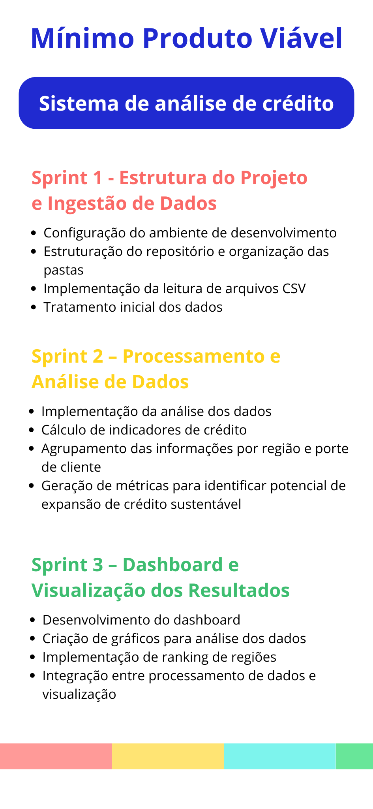

# DM-API

  |    
    <a href="#-descrição-do-desafio"> Descrição do Desafio </a> |
    <a href="#-backlog-do-produto"> Backlog do Produto </a> |
    <a href="#-mvp"> MVP </a> |
    <a href="#-sprints"> Sprints </a> |
    <a href="#-tecnologias-utilizadas"> Tecnologias Utilizadas </a> |
    <a href="#-links-da-documentação"> Links da documentação </a> |
    <a href="#-equipe"> Equipe </a> |

## 📌 Descrição do desafio
A DM card quer expandir a concessão de crédito de forma sustentável, evitando regiões com alto risco de inadimplência e identificando locais com maior potencial econômico.
Entretanto, os dados disponíveis do Sistema Financeiro Nacional, como os fornecidos pelo Banco Central, são complexos e dispersos, dificultando a análise rápida para tomada de decisão.

Este projeto propõe uma plataforma de inteligência de dados que:

- Analisa dados de crédito do Banco Central
- Identifica regiões com baixo risco de inadimplência
- Avalia potencial de crescimento de crédito
- Gera gráficos e rankings de regiões mais promissoras

Assim, o sistema auxilia analistas financeiros na tomada de decisão estratégica para expansão de crédito sustentável.
## 🗂 Backlog do produto
<table>
    <tr>
        <th>Rank</th>
        <th>User Story</th>
        <th>Sprint</th>
        <th>Estimativa</th>
    </tr>
    <tr>
        <td>1</td>
        <td>Como analista da DM Card, quero acessar o dashboard pelo navegador, para consultar os dados de crédito a qualquer momento.</td>
        <td>1</td>
        <td>5</td>
    </tr>
    <tr>
        <td>2</td>
        <td>Como analista da DM Card, quero visualizar o painel inicial com os dados nacionais de concessão de crédito, para ter uma visão geral antes de aprofundar a análise regional.</td>
        <td>1</td>
        <td>8</td>
    </tr>
    <tr>
        <td>3</td>
        <td>Como analista da DM Card, quero acessar o dashboard em qualquer dispositivo e tamanho de tela sem perda de funcionalidade, para consultar os dados onde estiver.</td>
        <td>1</td>
        <td>5</td>
    </tr>
    <tr>
        <td>4</td>
        <td>Como analista da DM Card, quero ver um gráfico de linha com a evolução dos indicadores ao longo do tempo para o estado selecionado, para entender tendências de crescimento da carteira naquela região.</td>
        <td>2</td>
        <td>8</td>
    </tr>
    <tr>
        <td>5</td>
        <td>Como analista da DM Card, quero comparar a taxa de inadimplência de múltiplas regiões em gráfico de barras e heatmap, para tomar decisões sobre onde expandir operações de crédito com baixo risco.</td>
        <td>2</td>
        <td>8</td>
    </tr>
    <tr>
        <td>6</td>
        <td>Como analista da DM Card, quero visualizar o ranking dos estados por volume de carteira ativa, para identificar as regiões com maior concentração de crédito e comparar sua evolução.</td>
        <td>2</td>
        <td>13</td>
    </tr>
    <tr>
        <td>7</td>
        <td>Como analista da DM Card, quero visualizar um score composto por estado que combine os indicadores de concessão, inadimplência e endividamento, para ter uma visão estratégica do potencial de expansão sustentável de crédito.</td>
        <td>3</td>
        <td>13</td>
    </tr>
    <tr>
        <td>8</td>
        <td>Como analista da DM Card, quero um mapa de calor do Brasil onde cada estado é colorido de acordo com o score de potencial de crédito sustentável, para identificar visualmente quais regiões concentram mais oportunidade.</td>
        <td>3</td>
        <td>13</td>
    </tr>
    <tr>
        <td>9</td>
        <td>Como analista da DM Card, quero entender quais dados do Banco Central são utilizados e como o índice de potencial é calculado, para validar a metodologia e ter confiança nas análises da plataforma.</td>
        <td>3</td>
        <td>5</td>
    </tr>
<table>

## 🏆 MVP

## 📅 Sprints
|🎯 Sprint | ✅ Staus    | 📅 Período  |📄 Documentação    |
| -------- | -------------|------------- | ----------------- |
| Sprint 1 | Em andamento |16/03 - 05/04 | Link documentação |
| Sprint 2 | Planejada    |13/04 - 03/05 | Link documentação |
| Sprint 3 | Planejada    |11/05 - 31/05 | Link documentação |

## 💻 Tecnologias utilizadas

  
  
  
  
  
  

## 🔗 Links da documentação
- [DoR (Definition of Ready) e DoD (Definition of Done)](docs/DoR-e-DoD.md)
- [Manual de instalação](docs/manual-de-instalação.md)
## 👨‍💻 Equipe

    <table>
        <tr>
            <th>Membro</th>
            <th>Função</th>
            <th>Github</th>
            <th>Linkedin</th>
        </tr>
        <tr>
            <td>Letícia Furtado</td>
            <td>Product Owner</td>
            <td></td>
            <td></td>
        </tr>
        <tr>
            <td>Isaura Batista</td>
            <td>Master</td>
            <td></td>
            <td></td>
        </tr>
        <tr>
            <td>Fernanda Pereira</td>
            <td>Developer</td>
            <td></td>
            <td></td>
        </tr>
        <tr>
            <td>Guilherme Rosa</td>
            <td>Developer</td>
            <td></td>
            <td></td>
        </tr>
        <tr>
            <td>Caio César</td>
            <td>Developer</td>
            <td></td>
            <td></td>
        </tr>
        <tr>
            <td>Isabela Araújo</td>
            <td>Developer</td>
            <td></td>
            <td></td>
        </tr>
        <tr>
            <td>Flávio Lins</td>
            <td>Developer</td>
            <td></td>
            <td></td>
        </tr>
        <tr>
            <td>Matheus Dias</td>
            <td>Developer</td>
            <td></td>
            <td></td>
        </tr>
    </table>

